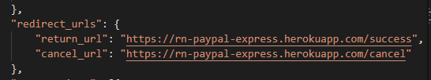
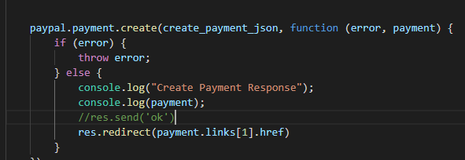
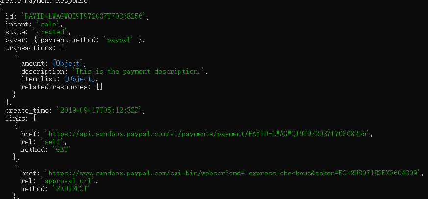
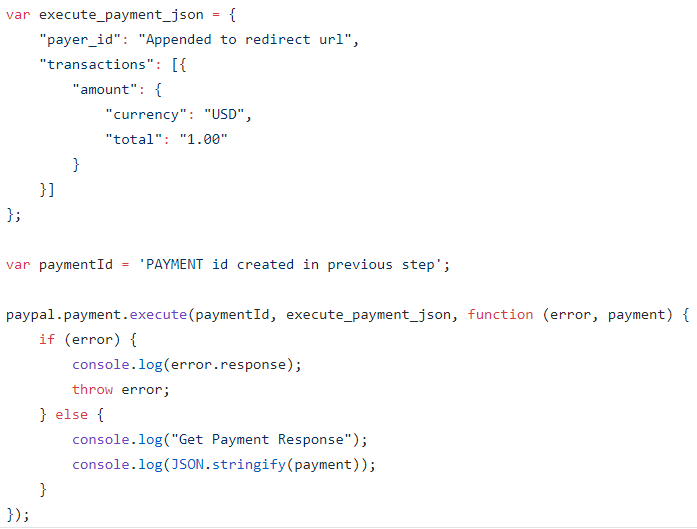
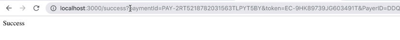

# React-native-paypal-express
1. We create a seprate server in express, to do this, first I create a paypal developer person account and a business account
2. After that I use this business account I've just created to create an App Called Test app
3. inside this app we have been given a client ID and Secrets 
4. for paypal configuration info, the details can be found here:
https://github.com/paypal/PayPal-node-SDK the return url set in the configuration tells where to go after the transaction is succeed, so if the transaction successful I want it to go '/success'. as a result, under the configeration, in app.get('/success',(req,res)) I set up the paypal execute function and render the page created in the views folder. 

The express project has been successfully pushed to heroku, so the return url has been changed from localhost

To redirect to the paypal payment, the redirect href can be found in console.log(payment). so first we can just simply say res.send('ok') to make it work and check the console log to find the href and put it back use redirect

we can find the herf in the console: 

5. for paypal execute info, the details can be found here:https://github.com/paypal/PayPal-node-SDK/blob/master/samples/payment/execute.js 

the payerID and payment ID are the link that can be found here. we can use req.query to get that info

